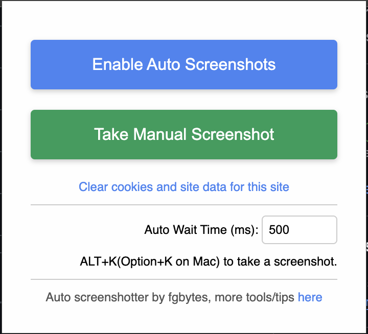

# fgbytes Auto Screenshot Saver

This Chrome extension automatically captures sequences of screenshots of web pages you visit and saves them to your downloads folder.

## Installation


To install this extension from GitHub:

1. Clone the repository or download the ZIP file:
   ```
   git clone https://github.com/fgbytes/autoscreen.git
   ```
   Or download and extract the ZIP file from the Releases section. [Releases](https://github.com/fgbytes/autoscreen-chrome/releases)

2. Open Google Chrome and navigate to `chrome://extensions/`

3. Enable "Developer mode" by toggling the switch in the top right corner.

4. Click on "Load unpacked" button that appears after enabling Developer mode.

5. Navigate to the directory where you cloned/extracted the extension files and select the folder.

6. The extension should now be installed and visible in your Chrome toolbar.

## Usage

1. Click on the extension icon in the Chrome toolbar to open the popup.

2. Click the "Enable Screenshots" button to start automatic screenshot capture.

3. Browse the web as normal. The extension will automatically capture screenshots of the pages you visit.

4. Screenshots are saved to your default Chrome downloads folder, organized by domain name.

5. To stop capturing screenshots, click the extension icon again and click "Disable Screenshots".

## Features

- Automatically captures screenshots of web pages you visit
- Organizes screenshots by domain name
- Easy toggle on/off functionality
- Respects restricted URLs (doesn't capture screenshots of Chrome internal pages)

## Note

Make sure you have allowed the extension to access file URLs and given it permission to download files in your Chrome settings.

## Contributing

Feel free to fork the repository and submit pull requests for any enhancements you develop.

## License

This project is open source. Please check the repository for license details.

## Support

If you want to support the creator and get access to more tips and tricks, you can join the community at https://locals.club/today-i-learned-hxfy.
